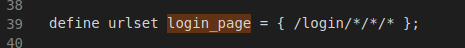
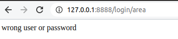

# PROGETTO SDC 2020 


# Gestione autorizzazioni Informazioni Covid-19


*   Angelo Silvestri
*   Damiano Nardi
*   Simone Bruno


# 


# Progetto

Si vuole aggiungere sicurezza e controllo ad un sistema di aggiornamento e  ricezione informazioni, relative al propagarsi del covid-19 nel territorio nazionale.

Per ogni regione il sistema gestisce** **le  informazioni alla giornata attraverso 


*   Inserimento dei dati relativi al numero di decessi, infetti, guariti e percentuale di infezione
*   Visualizzazione dei dati inseriti

Le regioni sono aggregate per area geografica Nord, Centro e Sud.


## Sicurezza Controlli e Report

Si vuole aggiungere controlli autorizzativi considerando i seguenti profili:


## Profili


*   **Governatore Regionale**: accesso e inserimento ai dati della singola regione
*   **Admin-Area-Geografica**: accesso e inserimento a tutti i dati dell’area geografica
*   **Admin-Governativo**: accesso e inserimento a tutti i dati

**La funzione di  login** è completata con la creazione ed associazione di un **cookie **per ogni utenza.

I dati di inserimento sono gestiti con funzione di Update attraverso il metodo POST


## Entità nell’architettura software


**<span style="text-decoration:underline;">N.B  la validation authority sarà implementata in ars/lisp e sarà il core del progetto</span>**


### Web Server (W.S.)

Si occupa di:


1. Servire i file di ogni regione divise per directory
2. Scrivere su file i nuovi dati giornalieri inseriti nella post rispetto a una regione

Il Web server è implementato in Python utilizzando la libreria **Flask**, che permette di generare un server locale. 

Tramite il comando **@app.route(“path”) **è possibile settare delle operazioni specifiche per un path specifico.

Nel nostro caso abbiamo due sezioni principali:


**&lt;path:path> **indica un qualsiasi path, quindi ad esempio sia “/regione/Campania” e “/regione/Molise” permettono l’esecuzione della funzione denominata _server_, la quale restituisce il file presente nel path “regioni/”+path.


Questa seconda funzione invece è utilizzata per aggiornare i dati in un file **.csv** regionali sui morti,infetti,guariti e la percentuale di infetti sul numero di persone totali nella regione.

Infine, la funzione run permette l’esecuzione del lato server sulla porta 5001.


N.B. il web server non fa nessun controllo riguardo le autorizzazioni


### Login Manager (L.M.)

Si occupa di:


1. Servire la rispettiva pagina di login 
2. Dare un cookie a seguito di una post con credenziali corrette

Ci saranno 3 pagine di login una per il governatore regionale una per l’admin area geografica e una per l’admin governativo.


La funzione _randString _genera una sequenza casuale di caratteri, che sarà utilizzata nella generazione del cookie.

Successivamente si leggono dei file json che contengono i dati degli utenti registrati nel server.

I file json sono strutturati in questo modo:


(la funzione _server _è uguale a quella presente nel file server.py)

La funzione _check_login _prende due input, db_json(file json) e req(array che conterrà gli elementi della richiesta HTTP ricevuta dopo aver effettuato il login); da quest ultimo si recuperano username,password,tipo(ossia tipo di account, ad esempio _admin regionale_).

Successivamente, per ogni utente trovato in db_json(ad esempio, “admin-area-nord”) viene effettuato un controllo if annidato:

Il primo if permette il corretto funzionamento del codice evitando casi in cui utente.get(tipo) sia None(evitando ad esempio _None.get(“nome”)_ che genererebbe errore) mentre il secondo if restituisce True solo se è presente una corrispondenza username e password con uno tra gli elementi presenti nel file json.     


La funzione _admin _genera un cookie da 100 caratteri con _randString_, una risposta con _make_response_ e setta il cookie solo se _check_login_ restituisce True.

In caso contrario, restituisce un messaggio di mancata corrispondenza username o password. 

Se il try non va a buon fine, restituisce un messaggio di Exception.

Ci sono altre due funzioni con lo stesso comportamento e codice molto simile, una per ogni tipo di account(admin regionale e admin di zona).

Anche per il login è presente la funzione run, però con porta 5000.

N.B. Ai fini del progetto consideriamo il Login manager come una entità pre-esistente implementate dallo Stato per gestire altri servizi


# Validation Authority (V.A.)


## 1.Gestire l’accesso alle rispettive regioni a tre livelli

L’accesso alle pagine di competenza è controllato dalle  **Access Rules & Validation Rules.**

La competenza è su tre livelli con i relativi coni di visibilità del dato.

Livello 1( nazionale ) accesso a tutti i dati.

Livello 2 (zona nord/centro/sud)  accesso ai dati delle regioni di zona.

Livello 3 ( regionale) accesso ai dati della regione.

Abbiamo definito le urlset per 6 regioni(due per ogni area regionale), per ogni area regionale e per l’admin nazionale:


La AR “passa login page” permette di visualizzare le pagine di login sulla porta 5000. 





Vediamo adesso il procedimento di login per l’admin nazionale.

Si accede alla pagina di login con l’apposita url e si inseriscono i dati(username,password).

Dopo aver effettuato il login, verrà creato un cookie(grazie al login manager) e successivamente viene eseguita la VR “verifica login admin nazionale”, la quale si attiva perchè:


*   È stato ricevuto un messaggio HTTP
*   L’url coincide con “/login/admin”

Grazie a questa VR, il nuovo cookie viene inserito in un set denominato session_admin, il quale viene utilizzato dalla AR “passa admin” per permettere l’accesso alle pagine protette, facendo il redirect alla porta 5001.


(Le altre operazioni di sql sono relative ai report, trattati dopo)

Il codice e le operazioni sono sostanzialmente uguali per quanto riguarda il login regionale e di zona.


## 2.Report delle azioni fatte

Report degli accessi e delle azioni che possono fare i vari profili, in particolare:


*   Richieste di spostamento da una regione ad un’altra;
*   Informazioni sul login di un utente;
*   Info di un computer bloccato.


I report sono memorizzati su database MySql 5.6 istanziato su una immagine di docker.

Report di login:

All’interno del codice per la funzione di verifica login, sono inseriti i comandi “_mysql.append_”, che permettono di eseguire delle query SQL.

In questo caso, viene eseguita una INSERT nella tabella **report**, aggiungendo nei campi url,ip,cookie,username,tipo ed esito i rispettivi valori esplicitati nell’insieme presente in riga 326 nel caso in cui il login abbia avuto risultato positivo.

Se il login ha avuto esito negativo, si può vedere in riga 335 ciò che viene memorizzato in tabella.


Codice molto simile viene eseguito per memorizzare le richieste di spostamento (memorizzando codicefiscale,partenza,arrivo ed esito nella tabella **richiestespo**)e le informazioni su un ip bloccato(memorizzando url della pagina e ip su tabella report).

Inoltre verranno effettuati dei report su tutte le altri azioni possibili che un utente può effettuare,

memorizzandole nella tabella report, come vediamo di seguito:


## 3.Notifica all’admin governativo di valori inseriti sopra la soglia 

In caso di valori elevati(ad esempio un numero eccessivo di infetti), il sistema memorizza su una pagina gestita dalla V.A. i dati anomali inseriti e invia una notifica di alert all’amministratore del servizio.


Viene definito un insieme _valori_critici _ il quale contiene i numeri da 50 a 100(considerati valori critici di percentuale).

La VR che si occupa di questo compito esegue la ACTION solo se durante l’inserimento dei dati l’utente è loggato come admin nazionale e se il valore percentuale rientra tra quelli critici.

Viene salvato nella tabella **vatable** la regione e la percentuale, inoltre l’url è aggiunta nell’insieme _regioni_interdette_(utilizzato nel controllo dello spostamento tra due regioni) per 259200 secondi.  


## 4.Rendere pubblici i dati

I dati potranno essere resi pubblici dall’admin nazionale  per un’ora andando sull’url  /PubblicaDati;


Analizziamo prima la VR “pubblica dati VR”.

Se l’url si trova nell’urlset PubblicaDati definito precedentemente(ossia se è /PubblicaDati) e se l’utente è loggato come admin nazionale, viene aggiunta la stringa “1234” al set pubblica_dati per 3600 secondi. Questo permette alla access rule “passa i dati se sono resi pubblici” di effettuare il tcp.redirect per permettere la pubblicazione dei dati, che sono inseriti in un file


## 5. Proteggere la pagina di login

Per proteggere la pagina di login da tentativi ripetuti di login con credenziali scorrette abbiamo implementato un meccanismo di blocco ip.

La VA garantirà la sicurezza del servizio impedendo l’accesso a tutte le “richieste anomale” (5 richieste di login consecutive sbagliate in un arco di tempo ravvicinato), così che che queste non raggiungano l’applicazione web ( **attacchi bruteforce**) 

Sono utilizzati 5 livelli per etichettare gli ip che hanno effettuato dei login errati ( il livello ultimo è il 5 ).

L’AR “blocca ip” se l’ip del computer che effettua una richiesta si trova nel livello 5, la VA notifica l’utente che il suo ip è stato bloccato.


Sono definite inoltre una VR per ogni livello, le quali permettono di inserire l’ip del computer che ha effettuato la richiesta nel caso in cui uno dei cookie relativi al tipo di account(admin,regione,area) non sia presente.

Qui in figura si vede la VR relativa al livello5, uguale a tutte le rispettive VR per gli altri livelli se non per l’aggiunta delle operazioni per eseguire un report sul database dell’ip bloccato.


## 6. Switch funzionale 

Si prevedono 2 modalità di esecuzione attraverso uno  switch:


1. Passante ( libera da regole)
2. Controllata ( con le regole di accesso)

Innanzitutto, la pagina di switch è accessibile solamente dall’admin nazionale, e l’accesso a questa pagina è gestita dalla AR apposita.


Una volta selezionata la modalità di switch dalla pagina “switch.html”, la VA utilizza le seguenti AR per notificare l’utente che lo switch è avvenuto con successo.


Lo switch vero e proprio è eseguito dalla VR “richiestaSwitch”, che aggiunge o toglie la stringa “ok” dal set _modalita_: questo set viene utilizzato dalle regole viste in precedenza per capire se si trova in modalità passante o controllata.


La VA permette l’accesso immediato a tutte le pagine protette con la seguente AR nel caso in cui si è in modalità passante:


Se si è in modalità controllata, il comportamento della VA rimane il solito, poichè le condizioni di questa AR non sono mai soddisfatte(“ok” non è presente in modalita).


## 7. Servizio di richiesta spostamento da una regione 

Dato un servizio in cui viene richiesto da un cittadino il permesso di spostarsi in un'altra regione/provincia, il servizio è interdetto per 15gg (quarantena) per tutte le regioni di origine/destinazione che hanno avuto un rischio (la percentuale di cui sopra) elevato.

Analizziamo le varie AR/VR che sono utilizzate per questo servizio.

“Serve richiesta spostamento”, risponde all’utente con la pagina **richiestaSpostamento.html **nel caso in cui sia digitata la url presente in sposta_url.


Una volta eseguito il form nella pagina richiestaSpostamento, la VA esegue la AR “richiesta spostamento SI” se le due regioni interessate dallo spostamento non si trovano nell’insieme _regioni_interdette_; di seguito risponde con una pagina di autorizzazione dello spostamento.


Nel caso in cui una delle due regioni sia presente in _regioni_interdette_(cioè in precedenza per questa regione è stato fatto un inserimento di dati covid con percentuale critica) la VA risponde con una pagina di notifica di spostamento non autorizzato.


Infine, la VR seguente esegue l’inserimento dei dati nel database per tutti e 3 i casi possibili visti in precedenza.


# Istruzioni per eseguire i vari componenti


## Start All

Per semplificare il deploy è stato creato uno script startAll.sh che istanzia il webserver delle regioni, il login-manager, la validation-authoritye mysql su container docker distinti non dovendosi preoccupare di eventuali dipendenze


##  Start del LoginServer

Posizionarsi sulla folder login-manager e avviare il server con l’istruzione:


```
sdc/progetto-SDC/login-manager$ python3 login.py 
```


Il server risponde sulla porta 5000


##  Start del WebServer 

Posizionarsi sulla folder


```
sdc/progetto-SDC/web-server$ python3 server.py 
```


Il server risponde sulla porta 5001


##  Start di MySQL

Seguire i command rilasciati nel progetto / mysql in particolare:


1. download.sh:  Download immagine docker
2. getInsideContainer.sh: Eseguire mysql nel container 
3. runMysql: startare Mysql la prima volta
4. commadnFodDb.txt Eseguire gli script presenti per il setting startup del database
5. startMysql: comando da utilizzare per i successivi run

Una volta presenti sulla bash chiamare>>mysql -u root -p


## Start ValidationAuthority

Posizionarsi sulla folder Validation-authority


```
docker run -it  --network=host --privileged --volume "$PWD":/volume1/sources/NEW_DEVS/DEPLOYED/GENERAL/volume dozenapps/va:latest va sdc.conf
```


## Accesso a 3 Livelli


### Login Admin

Si accede all’area amministratore utilizzando il link

http://127.0.0.1:8888/login/loginAdmin/login.html

(admin;password)


Attraverso questa operazione ci si logga come amministratore ed è possibile interagire con tutto il sistema; l’amministratore ha pieno accesso a tutte le aree funzionali


#### Report

Per ogni accesso all’area viene tracciato il log sul database.

Controlliamo il log tracciato su mysql


### Login Regionale 

http://127.0.0.1:8888/regione/Campania/dati/view.html


Attraverso questa operazione ci si logga come governatore regionale  ed è possibile interagire con le funzionalità della sola regione di governo .


#### Report

Per ogni accesso all’area viene tracciato il log sul database.

Controlliamo il log tracciato su mysql


### Login di Area 


Attraverso questa operazione ci si logga come admin di area  ed è possibile interagire con tutte le regioni appartenenti all’area .


#### Report

Per ogni accesso all’area viene tracciato il log sul database.

Controlliamo il log tracciato su mysql


### Insert e view

Per ogni regione è possibile inserire i dati e visualizzare quello che è stato inserito.

Analizzaimo una singola insert;

Qui è possibile inserire i dati relativi a decessi, infetti, guariti e percentuale

Vediamo uno screenshot:


 

Vediamo lo screenshot della view:

[http://127.0.0.1:8888/regione/Abruzzo/dati/view.html](http://127.0.0.1:8888/regione/Abruzzo/dati/view.html)


## Caso Sopra Soglia

[http://127.0.0.1:8888/regione/alert.html](http://127.0.0.1:8888//regione/alert.html)


## Richiesta Spostamento


La richiesta è di uno spostamento dalla Campania all Abruzzo e attualemente non ci sono pericoli.


Inseriamo ora una percentuale di infetti soprasoglia ( che è fissata a 50%)


I risultati di tutte le richieste con i relativi permessi accordati o meno si possono visualizzare alla pagina


```
http://127.0.0.1:8888/spostamenti/spostamenti.html
```


### Report

Possiamo controllare il log sul database eseguendo la query:

select * from vadb.richiestespo


## Rendere pubblici i dati

La pubblicazione dei dati è stata settata per 1 ora impostando la regola come segue:

define VR "pubblica dati VR"

(*aggiungiamo 1234 all insieme per rendere i dati pubblici per un ora*)

       CONDITION

              http.url is in PubblicaDati

              http.cookie['admin'] is in session_admin

       ACTION

              add "1234" to set pubblica_dati 3600

       ;


## Switch

La richiesta di switch permette di passare da una modalità controllate dalle regole VR eAR definite ad una modalità passante. 

Selezionando passante si avrà la possibilità di accedere alle pagine regionali senza necessità di loggarsi.

http://127.0.0.1:8888/richiesta/switch.html


## 


## Attacco Bruteforce

Viene controllato un possibile attacco bruteforce bloccando l’ip del richiedente al 5 tentativo di accesso fallito.

Il diagnostico a video per i primi 4 tentativi è il seguente 





Dal 5° tentativo in poi il sistema informa :


